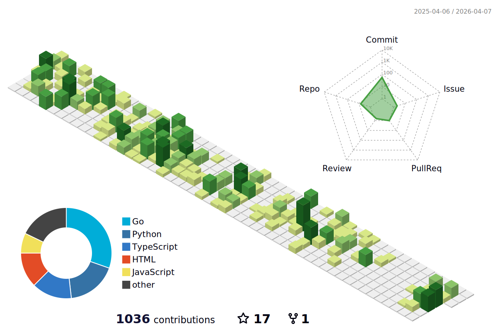

<!-- Top Gradient Banner -->

  

<!-- View Counter centered above the header (as requested) -->

  

<h2>Hi, I'm Gkirito 👋</h2>

  Web3 builder · Infra designer · Chain interoperability researcher 
  Building across chains — DA / Rollups / Bridges · Protocol engineering

<!-- Typing line (public instance) -->

 

<h3>🧰 Environment · Tools</h3>

  
  
  
  
  
   
  
  
  
  
  

<h3>🧠 Tech Stack</h3>

  <!-- row 1 -->
  
   
  <!-- row 2 (Helm uses Simple Icons because skillicons has no helm) -->
  

<h3>🚀 Currently Building in Web3</h3>
<ul>
  <li>DA & Modular Rollups — scalability, proof aggregation, shared security</li>
  <li>Cross-chain Infra — bridging between Bitcoin · EVM · DA layers</li>
  <li>Protocol & Infra Engineering — nodes, validators, staking & slashing logic</li>
  <li>Community — Avail KOL · hackathons · open-source contributor</li>
</ul>

<h3>⌛ Coding Activity (WakaTime)</h3>
<!-- Replace username= if needed -->
<!-- WakaTime card: auto switch light/dark -->
<picture>
  <!-- Dark mode -->
  <source
    media="(prefers-color-scheme: dark)"
    srcset="https://github-readme-stats.vercel.app/api/wakatime?username=Gkirito&layout=compact&hide_border=true&range=last_7_days&theme=github_dark&bg_color=00000000"
  />
  <!-- Light mode -->
  <source
    media="(prefers-color-scheme: light)"
    srcset="https://github-readme-stats.vercel.app/api/wakatime?username=Gkirito&layout=compact&hide_border=true&range=last_7_days&theme=default&bg_color=00000000"
  />
  <!-- Fallback (for old browsers or if media queries fail) -->
  
</picture>

<!-- 3D Contributions (auto-updated by action) -->
<picture>
  <!-- 深色主题用夜景静态图，加载稳；浅色用季节动画图，带一点动效 -->
  <source media="(prefers-color-scheme: dark)" srcset="./profile-3d-contrib/profile-night-rainbow.svg" />
  <source media="(prefers-color-scheme: light)" srcset="./profile-3d-contrib/profile-season-animate.svg" />
  
</picture>

<h3>🌐 Find me</h3>

  
  
  

<!-- Bottom Gradient Banner -->

  

